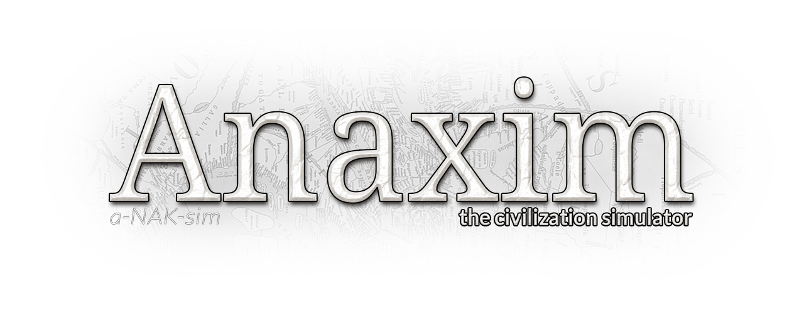

**Anaxim** *(pronounced *a-NAK-sim*, named after the ancient Greek philosopher and cartographer Anaximander)* is a civilization simulator made in ~~Ebitengine~~ ~~Fyne~~ [giu](https://github.com/AllenDang/giu), with the main goal of making a visually appealing and interactive timeline of the world using cellular automata.

# State
Currently the "game" only features a basic migration simulation on a map where you can see global statistics, inspect information of any cell by clicking and control the speed.

# Building
To build you need Go (1.21.4), a GCC compiler (for cgo) and depending on platform, some dependencies. Info below is mostly from the [giu readme](https://github.com/AllenDang/giu#install), which you'll need if you want to build on different platforms than Windows and Linux and **please refer to it if you have issues**.

**Warning! `go build` will seem to hang for a while the first time you try to compile as it needs to build the graphics drivers using GCC. Also a compilation warning might pop up from a demo file of github.com/AllenDang/imgui-go for some reason, just ignore it.** *"So much for fast Go compile times!" well, technically it's not Go. Feel free to fork giu to work without cgo.*

## Linux

1. Install [Go](https://go.dev/doc/install)
2. Install gcc
3. Install graphics library header files 
    - Debian / Ubuntu: `sudo apt install libx11-dev libxcursor-dev libxrandr-dev libxinerama-dev libxi-dev libglx-dev libgl1-mesa-dev libxxf86vm-dev`
    - Red Hat based: `sudo dnf install libX11-devel libXcursor-devel libXrandr-devel libXinerama-devel libXi-devel libGL-devel libXxf86vm-devel`
4. Compile! (See warning above)

        git clone https://github.com/greenthepear/Anaxim.git
        cd Anaxim
        go build

## Windows

1. Install [Go](https://go.dev/doc/install)
2. Install gcc
    - Save yourself the trouble and get [TDM-GCC](https://jmeubank.github.io/tdm-gcc/download/). You want the 64+32-bit MinGW-w64 edition.
4. Compile! (See warning above)

        git clone https://github.com/greenthepear/Anaxim.git
        cd Anaxim
        go build
          

# Running

You need to have the `Maps` directory in the same folder as the executable, at least with oldworld.png, as `./Maps/oldworld.png` is the default path to the map.

    .
    ├── Anaxim
    └── Maps
        └── oldworld.png

To change this run the program with a different `mappath` flag. This is explained below.

## Flags

Optionally, you can set flags from the command-line when launching Anaxim. They can be checked `./Anaxim -h`. For example:

    -mappath string
        Path to the map PNG file. (default "./Maps/oldworld.png")
    -prerun int
        Generations to simulate before launching, min 50

So `./Anaxim -mappath=./Maps/bigisland.png -prerun=20000` will prerun the simulation for 20,000 generations on a map generated from bigisland.png.

## Map file

The PNG map file is converted to a map grid like this:
- All pixels with RGB = [0,0,255] become water cells.
- All other pixel become land cells.
- Their habitability level is determined by (255-R)/255, so more red is less habitable.

# Planned features
- ~~Underlying world map~~
- Tribes and countries
- Wars and diplomacy
- ~~Speed/pause controls~~
- GPU acceleration with OpenCL (scary!)
- Interactivity
- Stats and graphs!
- ~~Custom maps~~ (and random maps?)
- Map modes

# Contributing
Sadly as I am writing a thesis on this project, I cannot accept any contributions until that's done (probably will take a few months). As the project is under GPL-3.0, I cannot stop you from forking and making your own Anaxim, but for now I would kindly ask to only contribute by sharing ideas with me and sharing Anaxim with the world instead. 
